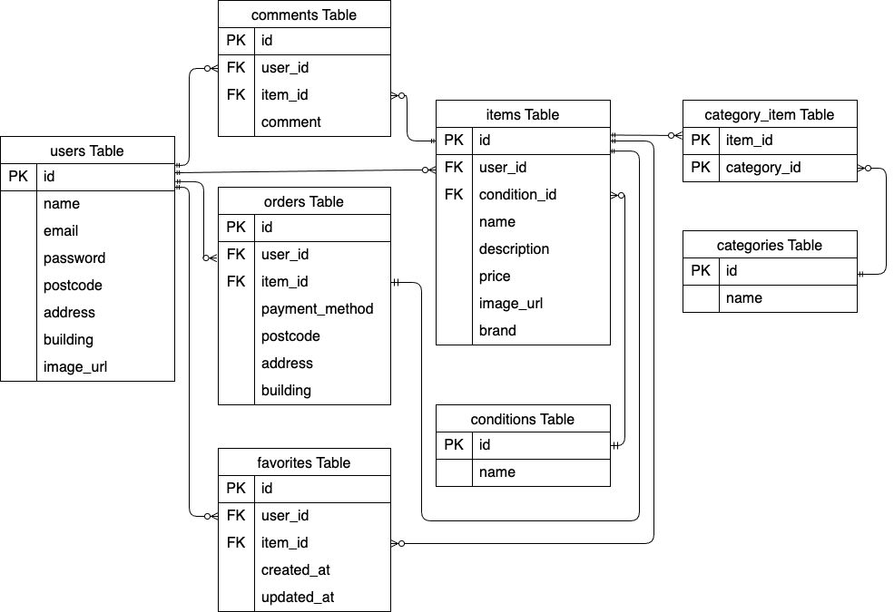

# coachtechフリマアプリ開発プロジェクト

## 1. プロジェクト概要
* **どんなアプリか？**：要件定義に基づいた、商品出品・購入が可能なフリマアプリ
* **開発目的**：アイテムの出品と購入を行うためのフリマアプリ開発
* **開発期間**：2026年2月23日〜2026年4月8日

## 2. 開発環境・動作確認方法

採点者様の手元で動作確認いただくための手順です。

### 使用技術(実行環境)
- **開発言語**: PHP 8.1.34
- **フレームワーク**: Laravel 10.50.2
- **サーバー**: nginx 1.21.1
- **データベース**: MySQL 8.0.26
- **インフラ/管理ツール**: 
  - Docker / Docker Compose
  - phpMyAdmin
  - GitHub

### 起動手順
## 環境構築
**Dockerビルド**
1. `git clone https://github.com/saiki-ayaka/flea-market.git`
2. DockerDesktopアプリを立ち上げる
3. `docker-compose up -d --build`

**Laravel環境構築**
1. `docker-compose exec php bash`
2. `composer install`
3. 「.env.example」ファイルを 「.env」ファイルに命名を変更。または、新しく.envファイルを作成
4. .envに以下の環境変数を追加
``` text
DB_CONNECTION=mysql
DB_HOST=mysql
DB_PORT=3306
DB_DATABASE=flea_market_db
DB_USERNAME=flea_market_user
DB_PASSWORD=flea_market_pass
```
5. アプリケーションキーの作成
``` bash
php artisan key:generate
```

6. ストレージのシンボリックリンク作成（画像表示に必要）
``` bash
php artisan storage:link
```

7. マイグレーションの実行
``` bash
php artisan migrate
```

8. シーディングの実行
``` bash
php artisan db:seed
```

### アクセスURL
ローカルサーバー起動後、ブラウザで以下にアクセスしてください。
- トップ画面: http://localhost
- ユーザー会員登録: http://localhost/register
- ログイン画面: http://localhost/login

### テスト用アカウント
動作確認の際は、以下の登録済みアカウントをご利用ください。
- メールアドレス1: test@example.com / パスワード: password
- メールアドレス2: test2@example.com / パスワード: password

## 3. データベース設計 (ER図)
データの整合性を保つため、以下の設計に基づいています。

## 4. 設計書

- [テーブル仕様書](https://docs.google.com/spreadsheets/d/1Rh6mHRqrsmxTM85r7PLgx4rUoGHsw_PO7napCECmD4k/edit?gid=1188247583#gid=1188247583)

## 5. 主要機能一覧
- ユーザー登録・ログイン機能
- 商品一覧表示・詳細表示
- 商品出品機能（画像アップロード含む）
- 商品購入機能（Stripe決済等）
- プロフィール編集機能
- お気に入り登録・解除機能
- コメント投稿機能
- 商品検索機能

### テーブル一覧
* **users**: ユーザー認証・プロフィール情報（配送先住所、プロフィール画像）
* **items**: 出品商品データ（出品者・状態・カテゴリ・ブランド等の紐付け）
* **favorites**: お気に入り登録機能（ユーザーと商品の重複登録を制限）
* **comments**: 商品詳細ページでのコメント投稿
* **conditions**: 商品の状態（「良好」「傷あり」などの選択肢）
* **categories**: 商品のカテゴリ（「家電」「メンズ」などの選択肢）
* **category_item**: 商品とカテゴリを紐付ける中間テーブル（多対多）
* **orders**: 商品の注文・配送情報（購入時の支払い方法・配送先を保持）
